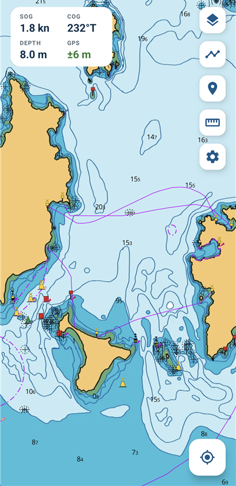
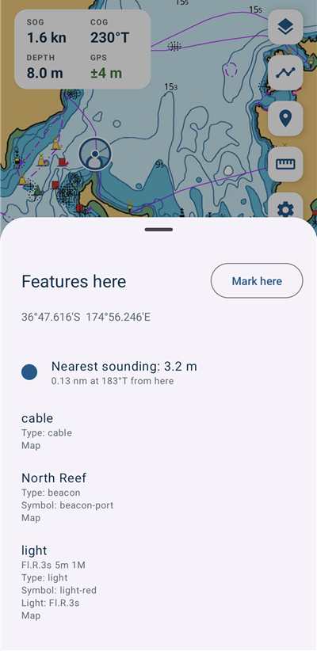
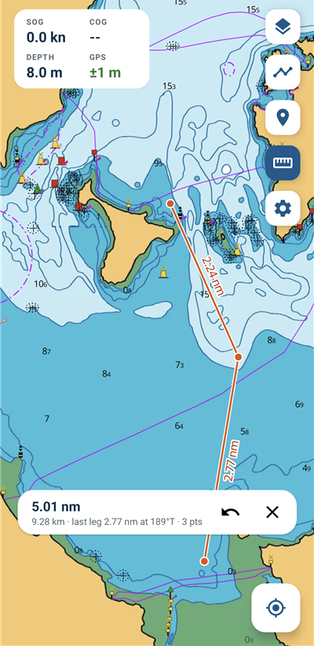
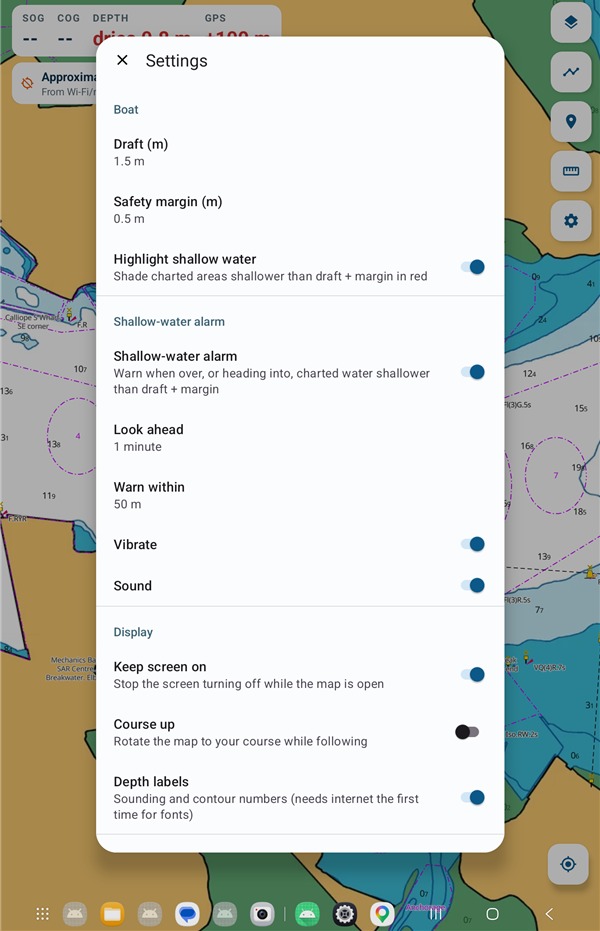

# Depthwise

[](https://github.com/JoshuaMorley/Depthwise/actions/workflows/build.yml)
[](https://github.com/JoshuaMorley/Depthwise/releases/latest)

Depthwise is an offline marine chart app for Android, for New Zealand waters. It draws chart packs
built from LINZ hydrographic data (PMTiles on the device), with live position, tracks, marks,
measuring and a shallow-water alarm based on your boat's draft.

Depthwise is an independent project. It is not made, endorsed or supported by Toitū Te Whenua
Land Information New Zealand (LINZ); it uses LINZ open data under the CC BY 4.0 licence.

> **Not for navigation.** Chart data comes from the LINZ Data Service and is not updated with
> Notices to Mariners. Depths are relative to chart datum and don't include tide. Use official
> charts for navigation.

## Download

**[⬇ Download the latest APK](https://github.com/JoshuaMorley/Depthwise/releases/latest/download/Depthwise.apk)**
(Android 11 or newer), or pick a version from [Releases](https://github.com/JoshuaMorley/Depthwise/releases).

To install, open the APK on your phone and allow installs from your browser or file manager when asked.
Then add a chart pack (see [Charts](#charts)).

## Screenshots

| Chart | Tap for details | Measure |
|:---:|:---:|:---:|
|  |  |  |

| Settings (tablet) | Start-up |
|:---:|:---:|
|  |  |

## Features

- **Full-screen offline charts** from PMTiles files on the device, or from remote PMTiles, XYZ or TileJSON sources
- **Chart packs:** each region is a folder or `.zip` with a `chartpack.json` that defines its layers, icons, layer toggles, tap info and alarm rules
- **Live position** with follow mode (north-up or course-up), and a status chip that says why there's no fix
- **Instruments:** SOG, COG, the depth of the nearest charted sounding, and GPS accuracy (each can be switched off)
- **Shallow-water alarm:** warns when you're over, or heading into, water shallower than your draft plus a safety margin, with sound and vibration
- **Tap anything** to see chart features and the nearest sounding, read at full chart detail
- **Measure:** tap points, or drag the map under a crosshair, with a distance on each leg
- **Tracks:** manual, automatic (starts new tracks after a break) or off, with colours, renaming and zoom-to
- **Marks:** long-press to drop a mark with a name, note and colour
- **Light theme**, tablet layout (Settings opens as a popup), and screen-on while charting
- No account and no login: it opens straight to the chart

## Charts

The app has no charts built in. Add them from **Charts → Add**:

- **Chart pack (.zip)** or **Chart pack folder:** a folder with `chartpack.json`, its `.pmtiles` and sprites
- **PMTiles file:** a single `.pmtiles`, styled automatically
- **Remote URL:** a `chartpack.json`, `.pmtiles`, TileJSON or `{z}/{x}/{y}` tile URL

You can also copy packs straight into the app's charts folder (the path is shown in Settings).

The pack format is described in [CHARTPACK.md](CHARTPACK.md). `tools/make_chartpack.py` writes a
`chartpack.json` for the LINZ chart build outputs and can zip the folder ready to import.

## Building

Open the project in Android Studio, or build from the command line:

```bash
./gradlew assembleDebug        # app/build/outputs/apk/debug/app-debug.apk
./gradlew testDebugUnitTest
```

Requires JDK 21 (Android Studio's bundled JDK works).

## Releases

Every push to `main` builds an APK in [GitHub Actions](https://github.com/JoshuaMorley/Depthwise/actions).
To publish a release, push a version tag:

```bash
git tag v1.1.0
git push origin v1.1.0
```

The workflow builds the APK, names it after the version, and attaches it (plus `Depthwise.apk` for the
download link above) to a GitHub Release.

- **versionName** is the tag (`1.1.0`); builds between tags are `1.1.0-dev.<run>+<commit>`
- **versionCode** is the workflow run number
- The version is shown at the bottom of Settings

Signed release APKs are built when these repository secrets are set; otherwise a debug APK is built:
`ANDROID_KEYSTORE_BASE64`, `ANDROID_KEYSTORE_PASSWORD`, `ANDROID_KEY_ALIAS`, `ANDROID_KEY_PASSWORD`.

## Data and licence

Chart data: contains data sourced from the LINZ Data Service licensed for reuse under
[CC BY 4.0](https://creativecommons.org/licenses/by/4.0/). Not for navigation.

Maps are drawn with [MapLibre Native](https://github.com/maplibre/maplibre-native).
